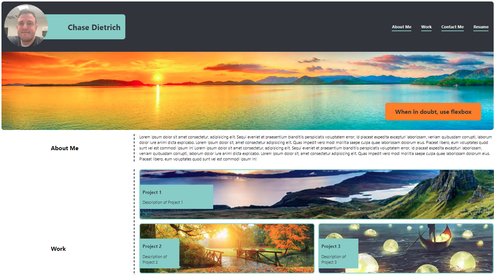
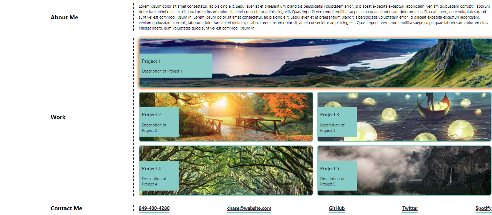
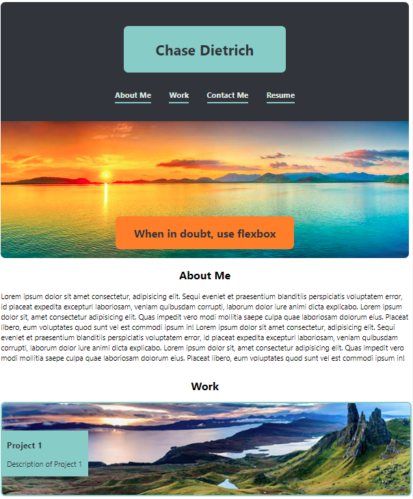
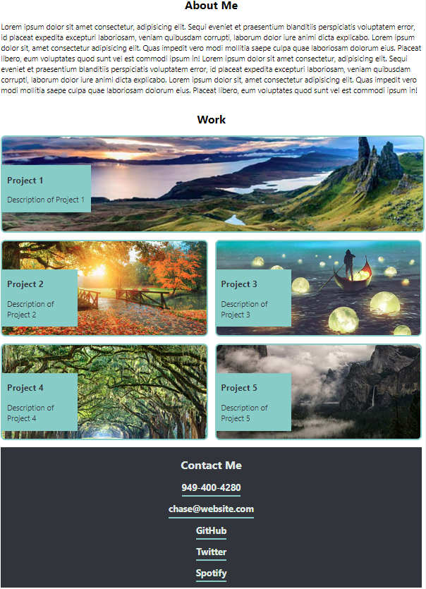

# Chase Dietrich - Portfolio Project

## Description

The goal of this project was to build a portfolio website for myself from scratch. What I build demonstrates the ability to use:

1. CSS Positioning
2. Flexbox
3. Media Queries/Responsive Layouts
4. CSS Variables

If you mutate the screen size from large to small, you will see that much changes when the display switches to a smaller screen.

## Screenshots

### Link to Application
